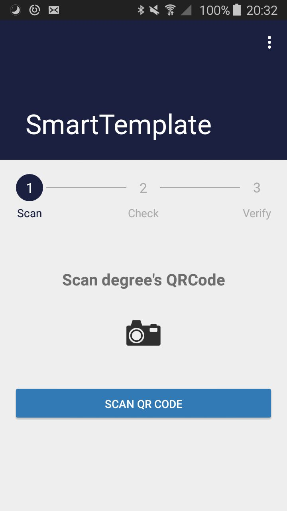
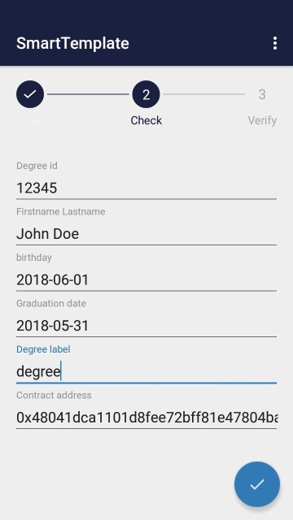
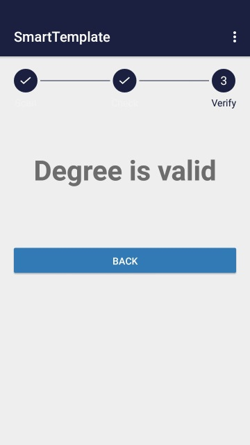
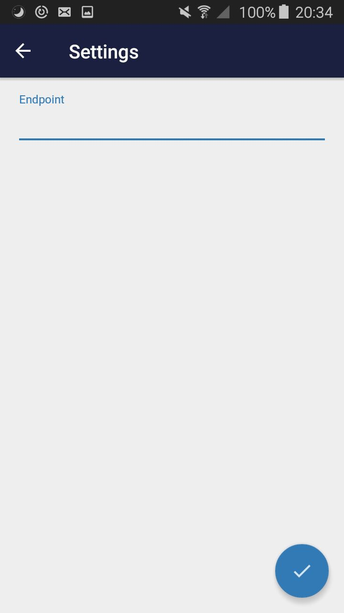

# Smart Degree

Smart degree aims to provide a decentralized solution to manage degree. The main idea is for a school, or any entity managing diplomas, to store diplomas validation proof on a blockchain system. Smart Degree currently uses Ethereum as backing blockchain. Once a degree is committed on the blockchain, anyone is able to verify if a degree has been validated by the entity. For example, an employer can verify qualification of a candidate during a job interview.

## Getting Started

Smart Degree Dapp Android repository contains :

* android application to interact with the smart degree contract
* see https://github.com/SmartContractCompanion/smart-degree

### Prerequisites

Android SDK installed

## Running android test application

This android application call a ethereum smart contract to verify degree's hash 

 

 

```
web3j truffle generate [LOCATION]/smart-degree/build/contracts/SmartDegree.json -o [LOCATION]/smart-degree-dapp-andrpod/app/src/main/java/ -p com.degree.application.contract
gradle assemble -PETH_NETWORK_URL="http://[IP]:[PORT]/"
```

You can scan a QR Code like this to fill in the form


## Authors

Adbelhamid Bakhta

Karim Taam

Ludovic Maréchal

## License

